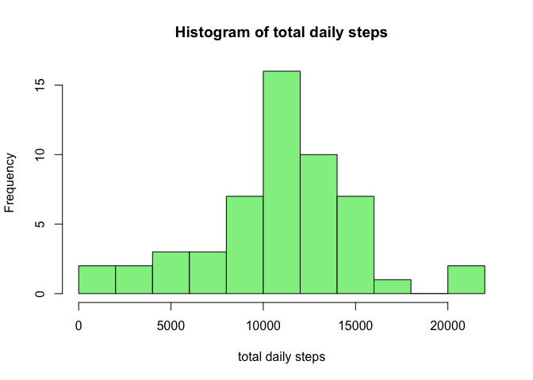
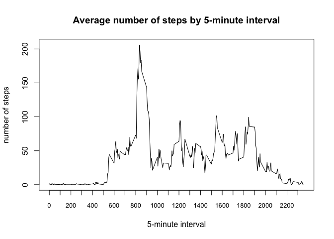
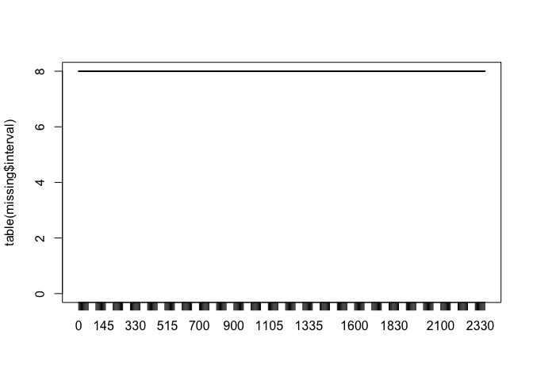
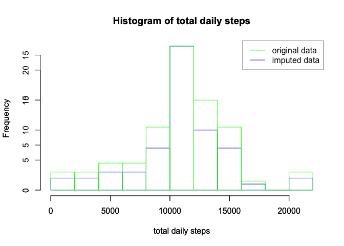
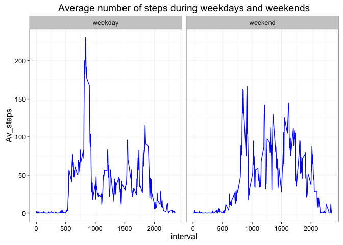

# Reproducible Research: Peer Assessment 1
Montserrat López Cobo  
21 March 2016  


```r
# --- Libraries ---------
require(dplyr)
require(lubridate)
require(ggplot2)
```


## Loading and preprocessing the data


```r
data <- read.csv("./Data/activity.csv")
summary(data)
```

```
##      steps              date          interval   
##  Min.   :  0    2012-10-01:  288   Min.   :   0  
##  1st Qu.:  0    2012-10-02:  288   1st Qu.: 589  
##  Median :  0    2012-10-03:  288   Median :1178  
##  Mean   : 37    2012-10-04:  288   Mean   :1178  
##  3rd Qu.: 12    2012-10-05:  288   3rd Qu.:1766  
##  Max.   :806    2012-10-06:  288   Max.   :2355  
##  NA's   :2304   (Other)   :15840
```

```r
str(data)
```

```
## 'data.frame':	17568 obs. of  3 variables:
##  $ steps   : int  NA NA NA NA NA NA NA NA NA NA ...
##  $ date    : Factor w/ 61 levels "2012-10-01","2012-10-02",..: 1 1 1 1 1 1 1 1 1 1 ...
##  $ interval: int  0 5 10 15 20 25 30 35 40 45 ...
```

```r
colSums(is.na(data))
```

```
##    steps     date interval 
##     2304        0        0
```

From the summary we can see that the variable *steps* has NA in 2304 cases. I will ignore them for the first part of the assignment.

## What is mean total number of steps taken per day?

To make the histogram I remove the days in which any interval does not have a corresponding steps numbers.


```r
stepsDay <- data %>% group_by(date) %>% summarise(Total_steps = sum(steps)) %>% 
    filter(!is.na(Total_steps))

hist(stepsDay$Total_steps, breaks = 10, main = "Histogram of total daily steps", 
    xlab = "total daily steps", col = "lightgreen")
```




```r
meanSteps <- mean(stepsDay$Total_steps)
medianSteps <- median(stepsDay$Total_steps)
```

The mean number of steps per day is 10766.19, and the median, 10765.


## What is the average daily activity pattern?


```r
stepsInterval <- data %>% filter(!is.na(steps)) %>% group_by(interval) %>% summarise(Av_steps = mean(steps))

plot(stepsInterval, type = "l", main = "Average number of steps by 5-minute interval", 
    ylab = "number of steps", xlab = "5-minute interval", xaxt = "n")
axis(1, at = seq(0, 2300, by = 100), cex.axis = 0.8)
```



The time series plot shows very low intensity until interval 500 (which corresponds to 5 am), which must be sleeping time, and a higher intensity for the rest of the day until 7 pm. There is a maximum around 8:30 in the morning, which might correspond to commuting time.  


```r
maxI <- stepsInterval[stepsInterval$Av_steps == max(stepsInterval$Av_steps), 
    1]
```
The 5-minute interval with highest average number of steps is 835.

## Imputing missing values

First I isolate the cases with missing values in *steps* and try to find a pattern in missing data.

```r
missing <- data[is.na(data$steps), 2:3]
head(missing)
```

```
##         date interval
## 1 2012-10-01        0
## 2 2012-10-01        5
## 3 2012-10-01       10
## 4 2012-10-01       15
## 5 2012-10-01       20
## 6 2012-10-01       25
```

```r
tail(missing)
```

```
##             date interval
## 17563 2012-11-30     2330
## 17564 2012-11-30     2335
## 17565 2012-11-30     2340
## 17566 2012-11-30     2345
## 17567 2012-11-30     2350
## 17568 2012-11-30     2355
```

```r
# Plot the frequency of each interval to find patterns
plot(table(missing$interval), type = "l")
```



```r
freqMissingInterval <- as.data.frame(table(missing$interval))
table(freqMissingInterval$Freq)
```

```
## 
##   8 
## 288
```

I plot the frequency of each interval in the missing data, and appears to be a uniform frequency of 8 per each interval. This means that there are 8 complete days with no recording of number of steps. Therefore, a simple and logical strategy for imputation would be to apply to those days the average number of steps observed in each interval for the valid days.


```r
data_imputed <- data
data_imputed[is.na(data_imputed$steps), 1] <- rep(stepsInterval$Av_steps, 8)
summary(data_imputed)
```

```
##      steps             date          interval   
##  Min.   :  0   2012-10-01:  288   Min.   :   0  
##  1st Qu.:  0   2012-10-02:  288   1st Qu.: 589  
##  Median :  0   2012-10-03:  288   Median :1178  
##  Mean   : 37   2012-10-04:  288   Mean   :1178  
##  3rd Qu.: 27   2012-10-05:  288   3rd Qu.:1766  
##  Max.   :806   2012-10-06:  288   Max.   :2355  
##                (Other)   :15840
```


```r
stepsDay_imputed <- data_imputed %>% group_by(date) %>% summarise(Total_steps = sum(steps)) %>% 
    filter(!is.na(Total_steps))

hist(stepsDay_imputed$Total_steps, breaks = 8, main = "Histogram of total daily steps", 
    xlab = "total daily steps", border = "blue")

par(new = TRUE)

# Plot original histogram over imputed data histogram
hist(stepsDay$Total_steps, breaks = 8, main = "Histogram of total daily steps", 
    xlab = "total daily steps", border = "green")
legend("topright", legend = c("original data", "imputed data"), col = c("green", 
    "blue"), lty = 1)
```



When plotting the imputed data we can see a similar histogram than before (blue histogram). But, if we compare with the original data where missing values were ignored (green histogram), we can observe a higher concentration of the imputed data around the mean. This is due to the use of the population mean as an estimation for the missing values. The mean and median of the imputed data set are 10766.19 and 10766.19 respectively. The mean stays unchanged, but the median has shifted to the value of the mean. This is because with the imputation we have introduced in the variable *steps* many cases with this value.

## Are there differences in activity patterns between weekdays and weekends?


```r
# Create a factor variable showing whether the day is a weekday.
data_imputed$weekday <- factor(ifelse(wday(data_imputed$date) %in% 2:6, "weekday", 
    "weekend"), levels = c("weekday", "weekend"))
data_imputed_wk <- data_imputed %>% group_by(weekday, interval) %>% summarise(Av_steps = mean(steps))

g <- ggplot(data_imputed_wk, aes(interval, Av_steps))
g <- g + facet_grid(. ~ weekday)
g <- g + geom_line(col = "blue")
g <- g + labs(title = "Average number of steps during weekdays and weekends", 
    xlab = "5-minute interval", ylab = "number of steps")
g <- g + theme_bw()
g
```



We can observe a different pattern in both groups. The maximum reached during weekdays has a higher frequency than the maximum reached during weekends. This finding supports the hypothesis of the commuting time around 8:35 am. Also, during weekends the number of steps is higher during the rest of the day, which might show activity during leisure activities.

